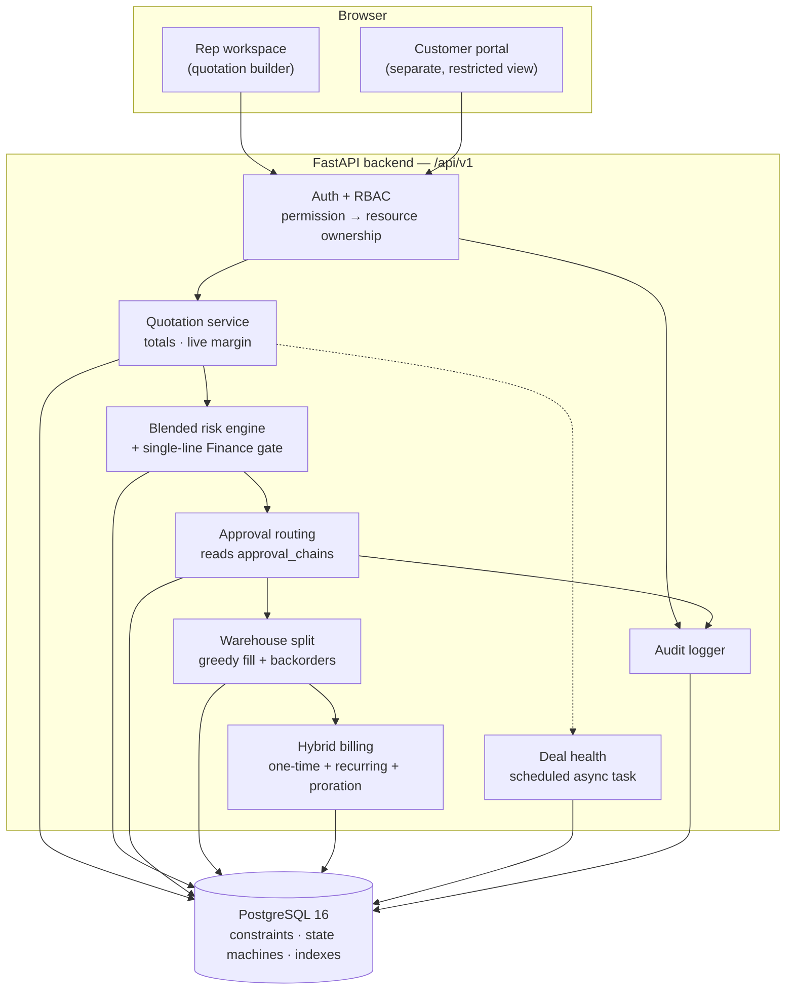
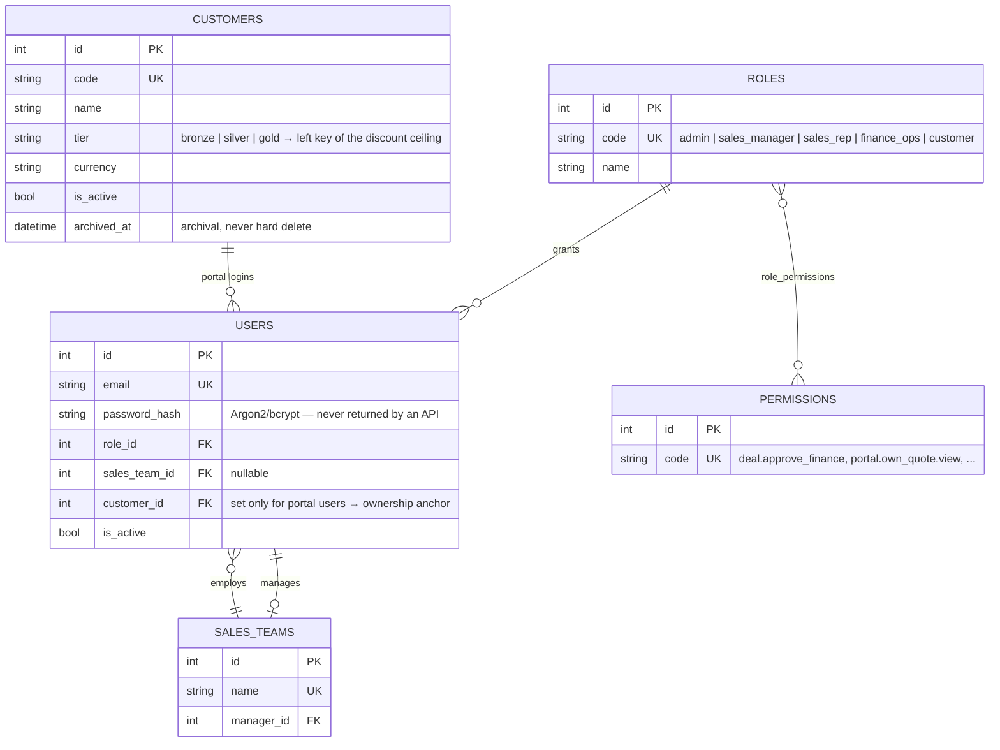
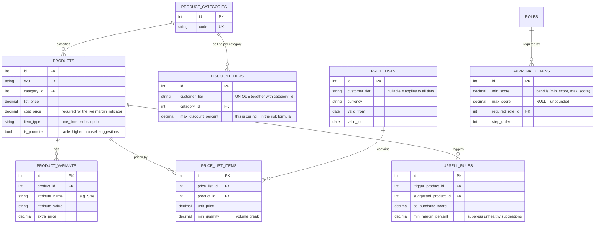
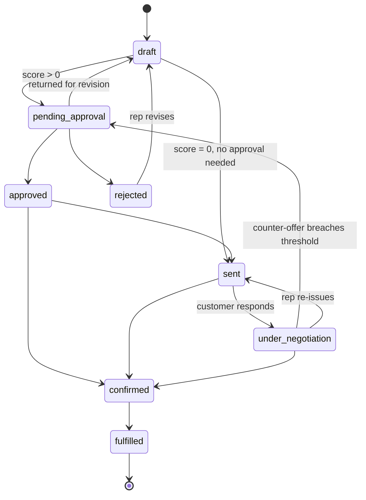
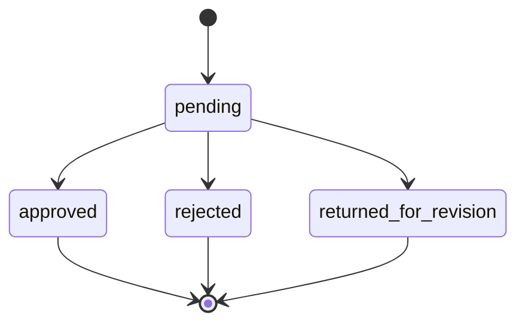
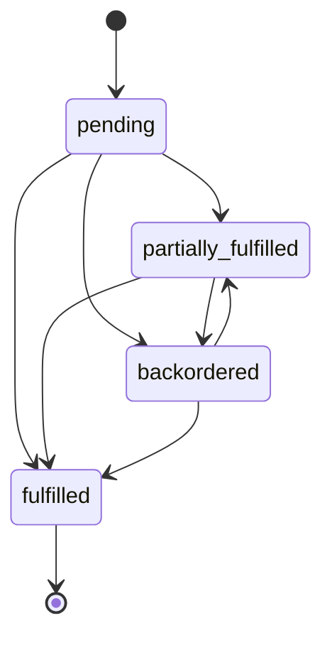
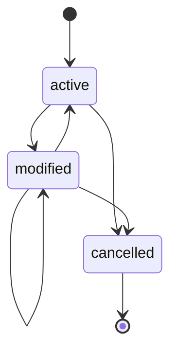
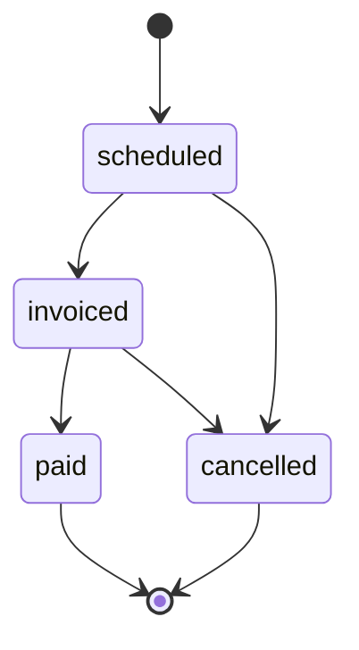
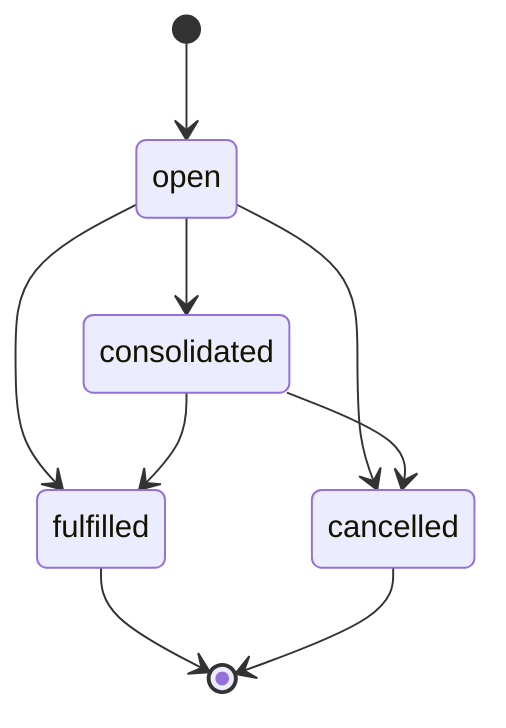

# DealFlow360 — Data Model & Architecture

Required deliverable of PLAN.md Phase 2, and doubles as the one-page
architecture diagram required by the hackathon spec (PRD Section 8).

**Keep this current.** If the schema changes and this file does not, the next
session inherits a lie. Source of truth is `backend/app/models/`; this is its
picture.

- 30 tables · 70 foreign keys · migration `809cac63fb15`
- Regenerate the table list with:
  `docker compose exec db psql -U dealflow -d dealflow360 -c "\dt"`

---

## 1. System architecture

Backend enforcement is authoritative throughout; the frontend hides controls
for usability only (SECURITY_SPEC.md).

---

## 2. Entity relationship diagram

Attributes are limited to keys and the columns that carry business meaning.
The full column list, with every CHECK constraint, is in
`backend/app/models/`.

All 30 tables appear below. The one without its own box is `ROLE_PERMISSIONS`,
the roles-to-permissions junction: it carries no columns of its own, so it is
drawn as the many-to-many edge between `ROLES` and `PERMISSIONS` rather than
as an entity.

### 2.1 Identity, access and customers

### 2.2 Catalogue, pricing and discount policy

### 2.3 Quotation, approval, fulfillment and billing

```mermaid
erDiagram
    CUSTOMERS ||--o{ QUOTATIONS : "places"
    USERS ||--o{ QUOTATIONS : "owns (rep)"
    QUOTATIONS ||--o{ QUOTATION_LINES : "contains"
    PRODUCTS ||--o{ QUOTATION_LINES : "sold as"

    QUOTATIONS ||--o{ APPROVAL_REQUESTS : "raises"
    APPROVAL_REQUESTS ||--o{ APPROVAL_STEPS : "ordered steps"
    USERS ||--o{ APPROVAL_STEPS : "decides"

    QUOTATIONS ||--o{ FULFILLMENTS : "ships via"
    FULFILLMENTS ||--o{ FULFILLMENT_SPLITS : "split across warehouses"
    FULFILLMENTS ||--o{ BACKORDERS : "shortfall"
    WAREHOUSES ||--o{ FULFILLMENT_SPLITS : "sources"
    WAREHOUSES ||--o{ STOCK_LEVELS : "holds"
    PRODUCTS ||--o{ STOCK_LEVELS : "stocked as"
    QUOTATION_LINES ||--o{ FULFILLMENT_SPLITS : "fulfilled by"

    SUBSCRIPTION_PLANS ||--o{ QUOTATION_LINES : "attached to"
    QUOTATION_LINES ||--o| SUBSCRIPTIONS : "becomes"
    SUBSCRIPTION_PLANS ||--o{ SUBSCRIPTIONS : "governs"
    SUBSCRIPTIONS ||--o{ PRORATION_RECORDS : "mid-cycle changes"
    QUOTATIONS ||--o{ BILLING_SCHEDULES : "bills as"
    SUBSCRIPTIONS ||--o{ BILLING_SCHEDULES : "instalments"
    BILLING_SCHEDULES ||--o{ PAYMENTS : "settled by"

    QUOTATIONS ||--o{ DEAL_HEALTH_SNAPSHOTS : "monitored by"
    USERS ||--o{ AUDIT_LOGS : "acts"

    QUOTATIONS {
        int id PK
        string quote_number UK
        int customer_id FK
        int owner_id FK "rep — the IDOR ownership anchor"
        string status "9-state machine, see section 3"
        decimal total_amount
        decimal margin_percent "live margin indicator"
        decimal blended_risk_score "value-weighted excess"
        decimal max_line_excess "drives the >15 Finance gate"
        bool requires_finance_approval
        datetime last_activity_at "stalled-deal detection"
        int version "optimistic lock"
    }
    QUOTATION_LINES {
        int id PK
        int quotation_id FK
        int line_number "UNIQUE per quotation"
        int product_id FK
        decimal quantity
        decimal unit_list_price "snapshot at quoting time"
        decimal unit_cost_price "snapshot"
        decimal discount_percent
        decimal allowed_discount_percent "ceiling snapshot — what the policy was"
        decimal line_excess_points "max(0, given - allowed)"
        string line_type "one_time | subscription"
        int subscription_plan_id FK "CHECK: required iff subscription"
        bool added_from_upsell
    }
    APPROVAL_REQUESTS {
        int id PK
        int quotation_id FK
        decimal blended_risk_score "snapshot the routing was based on"
        decimal max_line_excess
        bool triggered_by_line_gate
        string status "pending | approved | rejected | returned_for_revision"
    }
    APPROVAL_STEPS {
        int id PK
        int request_id FK
        int step_order "UNIQUE per request"
        int required_role_id FK "snapshot — chain edits cannot rewrite history"
        int actor_id FK
        datetime decided_at
        string reason "PRD: user, timestamp, reason"
    }
    WAREHOUSES {
        int id PK
        string code UK
        decimal shipping_cost_weight "primary sort key of the greedy split"
    }
    STOCK_LEVELS {
        int id PK
        int warehouse_id FK
        int product_id FK
        int variant_id FK "UNIQUE w/ NULLS NOT DISTINCT"
        decimal quantity_on_hand
        decimal quantity_reserved "CHECK: <= on_hand"
        decimal reorder_point
    }
    FULFILLMENTS {
        int id PK
        int quotation_id FK
        string status "pending | partially_fulfilled | fulfilled | backordered"
        int shipment_count
        decimal estimated_shipping_cost
        bool is_manual_override
        date promised_date "slippage baseline"
    }
    FULFILLMENT_SPLITS {
        int id PK
        int fulfillment_id FK
        int quotation_line_id FK
        int warehouse_id FK
        decimal quantity
    }
    BACKORDERS {
        int id PK
        int fulfillment_id FK
        decimal quantity_outstanding
        string status "open | consolidated | fulfilled | cancelled"
    }
    SUBSCRIPTION_PLANS {
        int id PK
        string code UK
        string billing_interval "monthly | quarterly | yearly"
        int interval_count
        decimal unit_amount
        string refund_policy
    }
    SUBSCRIPTIONS {
        int id PK
        int quotation_line_id FK "UNIQUE — one per line"
        string status "active | modified | cancelled"
        date current_cycle_start
        date current_cycle_end
    }
    BILLING_SCHEDULES {
        int id PK
        int quotation_id FK "hybrid billing reconciles here"
        int subscription_id FK "CHECK: required iff recurring"
        string schedule_type "one_time | recurring"
        string status "scheduled | invoiced | paid | cancelled"
        date due_date
        decimal amount
        bool is_credit_note
    }
    PRORATION_RECORDS {
        int id PK
        int subscription_id FK
        date change_date
        int cycle_days
        int remaining_days
        decimal credit_amount
        decimal charge_amount
        decimal proration_amount "signed; negative = credit note"
    }
    PAYMENTS {
        int id PK
        int billing_schedule_id FK
        decimal amount
        string method
        datetime paid_at
    }
    DEAL_HEALTH_SNAPSHOTS {
        int id PK
        int quotation_id FK
        bool is_stalled
        int days_inactive
        bool has_discount_anomaly
        decimal discount_vs_rep_average
        bool has_delivery_slippage
    }
    AUDIT_LOGS {
        int id PK
        int user_id FK "nullable — a failed login has no user"
        string action
        string resource
        string resource_id
        string status
        string ip_address
        string reason
    }
```

---

## 3. State machines

Enforced in `backend/app/services/state_machine.py`. Invalid transitions raise
`InvalidStateTransition` — they are rejected, not merely unused.

### Quotation

`cancelled` is reachable from every non-terminal state and is terminal, as is
`fulfilled`. `sent`, `under_negotiation` and `rejected` extend the list in
PLAN.md Section 7 — see PROJECT_CONTEXT.md for why.

### Approval (request and each step)

All three outcomes are terminal. A decided approval is never reopened — a
customer counter-offer raises a *new* request, so the record of who approved
what survives intact.

### Fulfillment

`backordered` returns to `partially_fulfilled` when stock arrives — this edge
is what the PRD's "Consolidate Remaining Backorder" prompt drives.

### Subscription

`modified → modified` is the one deliberate self-transition in the system: a
subscription can be changed again before the previous change settles.

### Billing schedule

A paid invoice is never re-edited; a correction is a credit note.

### Backorder

---

## 4. Modelling decisions worth defending

| Decision | Why |
|---|---|
| **Prices, costs and discount ceilings are snapshotted onto `quotation_lines`** | Master data changes. An approved quotation must remain reproducible, and `allowed_discount_percent` answers "what was the policy when this was approved?" |
| **Approval modelled as request → ordered steps** | Each step is a different person, time and reason. One row per decision is what makes the audit trail complete, and it is what the PRD's B4 step list displays. |
| **`approval_chains` is data, not constants** | PRD A3 requires the chain to be Admin-configurable. Editing policy must not need a redeploy. |
| **Chain and role snapshots on `approval_steps`** | Reconfiguring the chain later must not retroactively change who was supposed to approve a past deal. |
| **`version` column on `quotations`** | Two managers approving simultaneously would otherwise silently last-write-win. |
| **`NULLS NOT DISTINCT` on the stock unique index** | PostgreSQL treats NULLs as distinct by default, so a plain UNIQUE would allow duplicate stock rows whenever `variant_id` is NULL, and the split would under-count available stock. |
| **Enums stored as VARCHAR + CHECK, not native ENUM** | `ALTER TYPE` is painful to reverse in a downgrade; a CHECK constraint is ordinary DDL. The database still rejects invalid values. |
| **`audit_logs` deliberately lacks `updated_at` / `created_by`** | An audit row is never updated, and `user_id` already names the actor. A mutable timestamp on an audit table invites the tampering the table exists to detect. |
| **RESTRICT is the default FK behaviour; CASCADE is the exception** | CASCADE is used only where a child has no independent existence (lines, variants, approval steps, splits). Nothing cascades into quotations, approvals or audit records. |
| **Archival flags on master data, never hard delete** | A two-year-old order must still be reprintable. |
| **Surrogate integer primary keys** | SKUs and quote numbers do change; a changing primary key propagates into every referencing row. Business identifiers keep UNIQUE constraints instead. |
